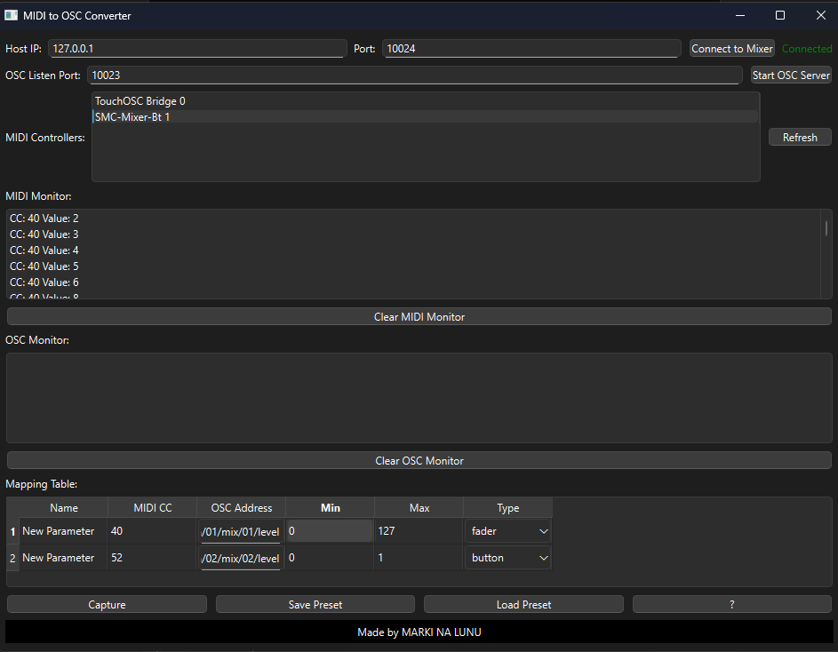

# MIDI to OSC Converter

## Overview
This application allows you to map MIDI Control Change (CC) messages to Open Sound Control (OSC) commands for controlling digital audio mixers like the Behringer XR18, X32 and all mixing consoles that are controlled via the OSC.



## Features
- Connects to a mixer via OSC
- Captures MIDI CC messages and maps them to OSC
- Supports faders and button mappings
- Saves and loads presets in JSON format
- Built with PyQt6 for a graphical user interface

## Requirements
- Python 3.11+
- Required Python libraries:
  ```sh
  pip install PyQt6 python-osc mido
  ```

## Installation
1. Clone the repository:
   ```sh
   git clone https://github.com/YOUR_GITHUB/MIDI_to_OSC.git
   cd MIDI_to_OSC
   ```
2. Install dependencies:
   ```sh
   pip install -r requirements.txt
   ```
3. Run the application:
   ```sh
   python OSC_INOUT.py
   ```

## Usage
1. Select a MIDI device.
2. Connect to an OSC mixer (set IP and port).
3. Map MIDI CC to OSC commands.
4. Use faders or buttons to control the mixer.

## Contributing
Feel free to submit issues and pull requests to improve the project!

## License
This project is licensed under the MIT License.

